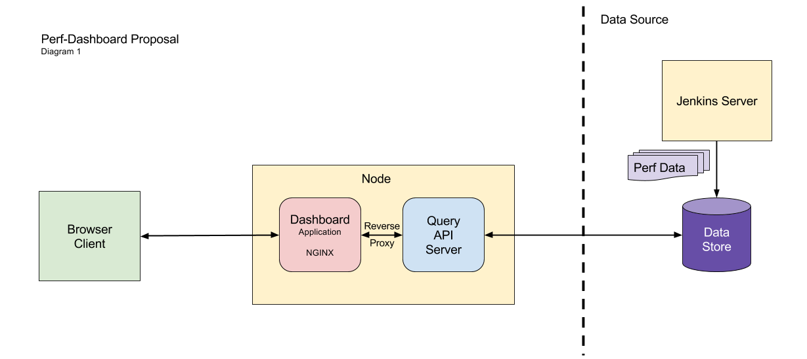

*This proposal template was taken from:*
[Go github repo][5]
*All credit goes to the original authors of this document.*

# Proposal: Performance Dashboard MVP

Author(s): Carlos Torres, Besan Abu Radwan, Victor Hugo Estrada

Last updated: 2017-01-12

## Abstract

We propose a dashboard/server that allows for the automated retrieval, and
display of performance tests results from any of the RPC-QE labs. This tool
will allow our team to identify performance issues and regressions as well as
facilitate the sharing of lab results with other teams.

## Background

Viewing performance test results from any of the QE labs as it trends across
time is tedious and repetitive. To view this data, the following actions must
take place:

1. Run Performance Test within Jenkins
1. Retrieve log file
1. Format data
1. User investigates data for information regarding performance issue
1. Display the data in a format that is easy to understand (graphs)
1. Share the visualizations of the tests with other developers

This set of actions occurs everytime there is a need to investigate lab
performance. These actions also requires a lot of time, meaning that by the
time the issue is resolved, it is too late to apply the solution becuase the
current release has already moved forward. Automating these actions allows more
time for developers to invest in development and investigation of performance
issues and shrinks the feedback cycle from the moment performance issues are
introduced in the code to the moment when a solution can be proposed.

Sharing these easily digestable performance results with other team members
currently requires a large portion of the team's time.  This can be minimized
by allowing other teams to have access to the dashboard/server so that they
can query the relevant test builds.

## Proposal

### Server

The system we propose requires the development of a server API that will be
used to serve queries that a user makes via the dashboard. To speed up the
initial development process, these queries will be hardcoded for test results.
Adding query build functionality for the user is a feature that will be
developed in future development cycles.

When the server receives input from the user (a query), the server will send
these queries to the data storage.  The data storage returns the filtered
performance test results. These results are then pushed to the dashboard.
The server expects a json result from the data store. The format and structure
of this json response is a task that will need to be completed during the
development of the perf-dash.

### Dashboard

The dashboard serves the purpose of allowing the user to make queries of the
results stored in the data storage unit. The dashboard provides a simple user
interface with a list of drop down menus for options such as: lab, config,
test, run, and metric. The dashboard communicates with the server (both
running on the same node) using an NGINX reverse proxy.

The query is made via HTML requests in the form of `GET /api/labs`,
`GET /api/labs/{lab id}`. The expected result is a json with the appropriate
test data. This json is then used to create the graph of the specified metrics
as they trend over past builds.

## Rationale

### Choice to build our own front-end

1. **Avoid Grafana learning curve**

   [Grafana][4] is used to facilitate performance monitoring in the performance
   test lab. The team is familiar with it and we have templated various
   visualizations for tracking the relevant metrics from each node in our
   cloud. Using Grafana still requires time to use, time that other teams do
   not have to invest. Our goal with the perf-dash is to allow other teams to
   access the page and quickly be able make queries and comparisons between
   different test runs. By minimizing the learning curve, we raise the
   probability that other teams will want to use our product.

1. **Need for metrics comparison of test runs across multiple labs**

   Grafana lacks the ability to directly compare multiple metrics from
   different test runs from different times. Since one of our goals is to create
   a tool that can be used to compare test runs across different lab
   environments it became clear that Grafana would not be able to fulfill our
   demands.

#### Alternatives

- *Any proposed alternatives and their arguments should be located here.*

### Choice of data storage

1. **Need for SQL-like querying with optimizations**

   [InfluxDB][1] is a database service optimized for temporal data, which is a
   characteristic common to performance test data. The querying language
   used is similar to SQL but incorporates time stamps and indexes off of
   these whenever filtering. This type of optimization is a benefit to
   the performance monitoring in this proposal because of the nature of
   performance analysis.

   Performance analysis requires the investigation of a series of metrics in a
   test as they trend across time, this results in the high likelihood of
   queried data being located close on the disk. These same time-based
   reasoning applies for writing to disk, a write of performance metrics is
   very likely followed by a similar metrics at a time interval ahead in time;
   the implication being that the next write will occur close by on the disk.

1. **Established database with historic performance data**

   Previous performance data taken by the team is currently stored in an
   InfluxDB server. Uniformity between our past, current, and future datasets
   will ensure that we can make comparisons between different test results.
   We can accomodate new and different data by properly using tags, a feature
   of the InfluxDB query language.

## Implementation

@meteorfox has volunteered to set up the scaffolding for both the server and
the dashboard. The goal is to leave a foundation that can be handed over to
@besanradwan and @vhe182 to work on developing the dashboard and server,
respectively. Both of these team members will develop their system in tandem.
These systems will use mocks for sending and receiving requests from the user,
dashboard, server, or data storage.

### Server Layout

The server API will include those listed below and more will be added as the
need for them arises during the development of the perf-dash. Server
functionality requirements are to:

- Make queries to data storage using the predefined queries in static files
  and selected by the user.
- Serve the data to the front-end.

### Dashboard Layout

bird

## Open issues

### Metric, Test, and Build Tagging

1. Currently, the performance data we have has not been tagged to distinguish
   the different metrics, test type, or build run. To be able to query by
   these characteristics, the data must be tagged accordingly. A scheme must
   be designed that allows for accessing current metrics. This scheme must also
   be able to expand into new tests and metrics in the future. This same data
   should also be able to be queried via KPIs so as to facilitate tracking.

[1]: https://www.influxdata.com/
[2]: https://d3js.org/
[3]: http://jtblin.github.io/angular-chart.js/
[4]: https://grafana.net/tour
[5]: https://github.com/golang/proposal/blob/master/design/TEMPLATE.md
